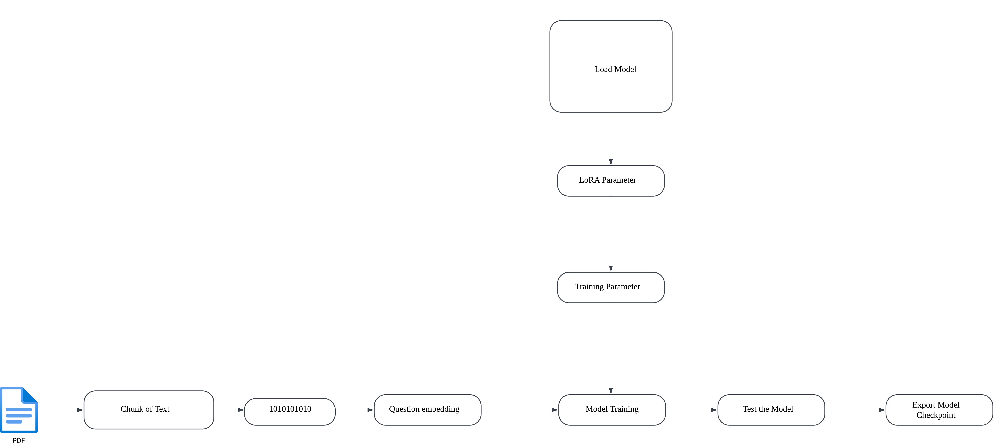
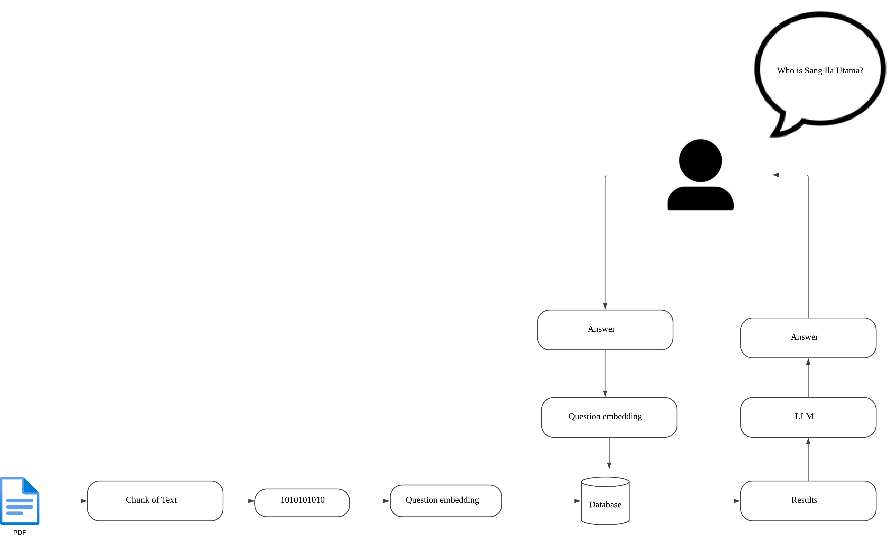

# Singapore History-Based Trivia Chatbot AAI3008

## Memners
- Muhammad Azreen Bin Muhammad
- Chan Jit Lin
- Leong Tuck Ming Kenan
- Wong Jun Kai
- Justin Tan Yong An

## **Overview**

This project aims to develop a personalized NLP learning assistant specializing in Singapore’s history, utilizing Retrieval-Augmented Generation (RAG) technology. The system will leverage the SIT library to create an engaging and educational platform delivering accurate and well-sourced historical information through interactive conversations. The chatbot will serve as both an educational tool for students and a public resource for anyone interested in Singapore’s rich history. 

## Problem Statement
Traditional methods of learning Singapore's history often lack engagement and accessibility, leaving extensive historical resources underutilized. This underutilization stems from several key challenges: limited accessibility of physical materials, difficulty in quickly finding specific historical information, a lack of interactive learning tools for Singapore's history (especially for students who wish to study on their own), and the challenge of verifying historical accuracy from online sources

## Features
- **Provides instant access to verified historical information**
- **Ensures accuracy through proper source attribution**
- **Creates an engaging, conversational learning experience** 
- **Makes local history more accessible to students and the public**

## Architecture
The system will primarily utilize Wikipedia and public libraries as its knowledge base, accessing real-time data across multiple categories including Singapore's history, science, arts, sports, and geography. The data pipeline will handle HTML parsing, text preprocessing, and content extraction to ensure clean, relevant information. The system will maintain a cache of frequently accessed articles to optimize performance and reduce API calls.

## Instuction
1. Run the dependencies on the requirement.txt
2. For Training.ipynb follow the instructions on the notebook to train your model with the pdfs you provided (**NOTE** this runs Unsloth so it requires a CUDA capable GPU (E.g PASCAL onwards))
3. 

## Note
The dataset used for training the chatbot is not included in this repository to comply with data privacy and copyright policies. The repository will not provide said dataset to adhere to copyright laws.

